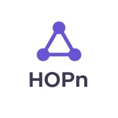

<div align="center">
  
  <h1>Aurix Intel</h1>
  <p><b>The Agentic Wealth Co-Pilot for Digital Gold</b></p>

  [](https://anthropic.com)
  [](https://elevenlabs.io)
  [](https://fastapi.tiangolo.com)
  [](https://react.dev)
</div>

---

## 🚀 The Vision
**Aurix Intel** is a premier intelligent pipeline developed for the **HOPn** ecosystem. It bridges the gap between raw quantitative market data and human-centric wealth management. By combining **Random Forest ML forecasting** with a **Multi-Agent reasoning loop**, Aurix provides an "Elite Analyst" experience for every user.

---

## 🧠 System Architecture (The "Brain" Workflow)
The intelligence is not a single prompt; it is a **Adversarial Multi-Agent System**:

1.  **The Analyst (ML):** A Random Forest Regressor analyzes 5 years of historical gold volatility to generate a 5-day price target.
2.  **The Quant (Agent):** Powered by **Claude 3.5 Sonnet**, this agent receives the live spot price (via Yahoo Finance) and technical indicators (RSI/SMA).
3.  **The Auditor (Governance):** A separate agent validates the Quant's advice for logical contradictions, ensuring risk alignment before the user ever sees a recommendation.

---

## 📊 Evaluation Core (Parts 1-3)
- **Decision Engine:** Hybrid Buy/Hold/Sell logic based on trend momentum and ML forecast.
- **Data Simulation:** Bridges historical datasets with **Real-Time Data Injection** to prevent data drift.
- **API (FastAPI):**
    - `GET /recommendation`: Returns full decision metadata + raw input data (RSI, Sentiment, ML signals).
    - `GET /chat`: Fully agentic interactive Co-Pilot.

---

## 🏗️ System Design Thinking (Part 4)

### **Scalability & Ops**
- **Persistence:** Uses `joblib` for model caching, ensuring 0ms training latency during container cold-starts on AWS.
- **Statelessness:** The backend is fully Dockerized and ready for horizontal scaling via **AWS ECS/Fargate**.
- **Hardened Security:** Built-in Nginx proxy layer to isolate the backend and prevent direct unauthorized API access.

### **Future Roadmap**
- **Reinforcement Learning:** Transitioning from Random Forest to a **Deep Q-Network (DQN)** where the agent learns optimal entry/exit policies through market episode simulation.
- **Predictive Streaming:** Moving from REST to **WebSockets** for letter-by-letter agent reasoning.

---

## 🌟 Optional Bonus Implementation (Part 5)
### **1. Visual Momentum Dashboard**
A custom React dashboard with **Predictive Chart Stitching**, showing historical trends merged with a dashed 5-day AI forecast.

### **2. Spoken Intelligence (Voice AI)**
Integrated **ElevenLabs Conversational AI** via WebRTC. Users can speak directly to the "HOPn Pulse Orb" to receive spoken portfolio briefings.

---

## 📦 Rapid Deployment
```bash
# Force a clean, hardened build
docker-compose up --build --no-cache -d
```
*Requires `ANTHROPIC_API_KEY` and `ELEVENLABS_API_KEY` in `backend/.env`*

---
<div align="center">
  <b>Developed by:</b> ALI Elmowafi<br>
  <b>Project Context:</b> Technical Evaluation for HOPn / Aurix
</div>
